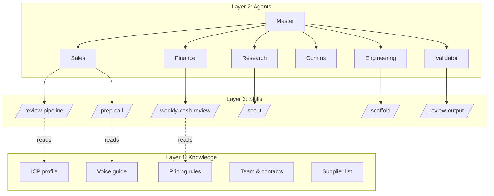
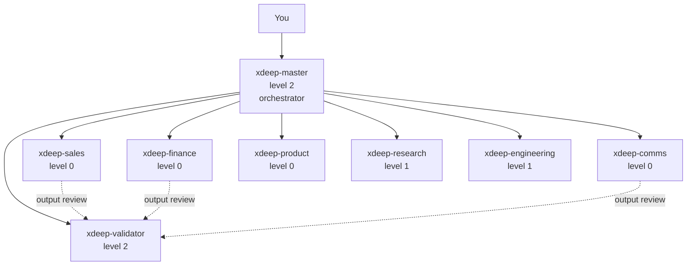

# Architecture

X-DEEP OS is built on three layers that separate concerns. This document explains each layer, how they interact, and why the separation matters.

For the philosophical rationale, see [`architecture-principles.md`](architecture-principles.md).

---

## The three layers



### Layer 1 — Knowledge

Location: `.agent/knowledge/articles/`

**Question it answers**: *What is true in this domain?*

Knowledge is compiled, versioned markdown. It describes the state of the world — the company, the users, the market, the rules. It evolves slowly, is read often, and lives in version control.

Examples:
- `articles/sales/icp-profile.md` — who you sell to
- `articles/comms/voice-guide.md` — how you talk
- `articles/finance/pricing-tiers.md` — your tiers and guardrails
- `articles/ops/supplier-list.md` — who you source from

Knowledge is compiled from raw inputs in `.agent/raw/` via the `/ingest` skill. Raw inputs are immutable (corrections, decisions, documents); compiled articles synthesize them.

**Rule of thumb**: if information is useful across multiple skills or conversations, it belongs in knowledge. If it's specific to one task, it belongs in the skill.

### Layer 2 — Agents

Location: `.agent/templates/*.yaml`

**Question it answers**: *Who am I and what's my mission?*

Agents are identities with a scope, constraints, and an autonomy level. They own skills. They report to a parent (usually the master) or to `human` (only the master does).

Minimal structure:
```yaml
agent:
  id: xdeep-sales              # kebab-case, unique
  name: X-DEEP Sales
  role: AI sales director
  goal: Close deals with progressive autonomy
  backstory: >
    Expert in B2B service sales. Knows the ICP, the voice guide,
    and the pipeline methodology. Direct, peer-to-peer tone.
  autonomy_level: 0            # 0=propose, 1=approve-before, 2=review-after, 3=full-auto
  constraints:
    - Max 2 follow-ups per prospect
    - ASCII-only email subjects
    - Never send without validation at level 0
  tools_allowed: [gmail, notion, calendar]
  skills_owned: [review-pipeline, prep-call, draft-followup]
  reports_to: xdeep-master
  output_validation: required  # required | optional | none
```

The **autonomy level** is the key promotion mechanic:

| Level | Behavior | Promotion criteria |
|---|---|---|
| 0 | Propose → user executes | Default for new agents |
| 1 | Execute → user approves before action | >90% approval over 20+ actions |
| 2 | Execute → user reviews after | >90% approval over 50+ actions |
| 3 | Full autonomous, weekly audit only | >95% approval over 100+ actions + explicit user validation |

Promotion is handled by the `autonomy-promotion` protocol (see `.agent/protocols/autonomy-promotion.md`). Demotion happens automatically if approval rate drops below 80%.

### Layer 3 — Skills

Location: `.claude/skills/<name>/SKILL.md`

**Question it answers**: *How do I perform a specific task?*

Skills are instructions — step-by-step procedures with a clear trigger, inputs, steps, and expected output. They are **verbs** (or verb-nouns). They do not carry identity.

Minimal structure:
```markdown
---
name: prep-call
description: Generate a pre-call brief for a prospect or customer meeting
user_invocable: true
triggers:
  - prep call
  - pre-call brief
  - /prep
---

# /prep-call

Generate a brief ahead of a scheduled meeting.

## When invoked
- User asks "prep the call with Lopez"
- A meeting is in < 2h and no brief exists yet

## Steps
1. Read `.agent/knowledge/articles/sales/icp-profile.md`
2. Read the prospect's enrichment data from `/contacts/<id>.md`
3. Look up the last 5 interactions (email, calendar) via MCP
4. Apply the voice from `.agent/knowledge/articles/comms/voice-guide.md`
5. Produce the brief in the agreed format

## Output
```
BRIEF: <Company> — <contact>
Context: <2 sentences>
Open questions: <3 bullets>
Goal for this call: <one sentence>
```

## Guardrails
- Max 500 words
- Always cite sources for factual claims
```

**Rule of thumb**: a skill is under 200 lines. If it grows larger, the knowledge is probably leaking in — extract to `.agent/knowledge/articles/`.

---

## How the layers interact

### Read path (user asks for something)

```
User: "prep the call with Lopez"
    ↓
[xdeep-master] receives → delegates to [xdeep-sales]
    ↓
[xdeep-sales] invokes /prep-call skill
    ↓
/prep-call reads:
    - .agent/knowledge/articles/sales/icp-profile.md (what is our ICP)
    - .agent/knowledge/articles/comms/voice-guide.md (how do we write)
    - memory/contacts/lopez.md (what do we know about Lopez)
    - MCP Gmail + Calendar (recent interactions)
    ↓
/prep-call outputs the brief
    ↓
Returns to [xdeep-sales] → applies constraints (ASCII, word limit)
    ↓
Returns to [xdeep-master] → level 0 = propose to user
    ↓
User approves → brief is sent
```

### Write path (learning from interaction)

```
User rejects the brief: "too formal, drop the first paragraph"
    ↓
[xdeep-master] detects correction
    ↓
Writes to .agent/raw/2026-04-14-correction-voice-too-formal.md
    ↓
/ingest skill runs:
    - Extracts the rule: "voice is direct, skip formal openers"
    - Updates .agent/knowledge/articles/comms/voice-guide.md
    - Appends to .agent/rules.md
    ↓
Next /prep-call will read the updated voice-guide
```

This write path is the **continuous learning loop**. Corrections don't get forgotten; they become rules.

---

## The master + sub-agents pattern



The master owns the conversation and global context. Sub-agents are narrow specialists. Why this works:

- **Smaller surface** — each sub-agent has fewer constraints to juggle than a monolithic assistant, so it's more reliable in its narrow domain
- **Individual metrics** — each sub-agent has its own `approval_rate`, which makes promotion/demotion objective
- **Parallel improvement** — research on `xdeep-sales` doesn't block `xdeep-finance`
- **Scope protection** — a finance error can't corrupt sales methodology because they touch different files

The **validator** agent is special: it reviews HIGH-risk outputs (send-email, pay, publish) before execution. It doesn't produce; it reviews. See [`.agent/protocols/validation.md`](../.agent/protocols/validation.md).

---

## Shared coordination

The three layers and the sub-agents all share:

### `.agent/state.json`
The single source of truth. Lists every agent, their current autonomy level, their skills, and their stats. Validated on every change by `validate-state.mjs`.

### `.agent/changelog.md`
Every significant action from every agent and every surface (terminal, Telegram) writes a line here. Format: `- YYYY-MM-DD HH:MM | surface | action`.

This is **the coordination channel** when you have 2-3 Claude Code sessions + Telegram running in parallel. At the start of each conversation, Claude reads the last 15 lines to know what other sessions did.

### `.agent/rules.md`
Self-evolving rules. The learning protocol and nightly-audit append to this file.

Format: `[YYYY-MM-DD] <rule> (source: <agent|user> — <context>)`

Example:
```
[2026-04-14] ASCII-only email subjects (source: user — MCP Gmail corrupts UTF-8)
[2026-04-14] Always git pull before working and before pushing (source: user)
[2026-04-14] Max 2 follow-ups per prospect then mark COLD (source: sales — rule from CRM)
```

### `.agent/queue.md`
Actions proposed by agents, awaiting user validation. Agents at level 0 or 1 write proposals here rather than executing. Keeps the signal-to-noise high in Telegram notifications.

---

## Quality gates

### Schemas (`.agent/schemas/`)
- `state.schema.json` — `state.json` structure (required keys, no duplicates, valid autonomy enum)
- `agent-template.schema.json` — YAML templates (kebab-case id, `reports_to` resolves)
- `skill-frontmatter.schema.json` — SKILL.md frontmatter (unique kebab-case name)

### Validators (`.agent/scripts/`)
- `validate-state.mjs`
- `validate-templates.mjs`
- `validate-skills.mjs`
- `validate-all.mjs` — single entry point for CI and hooks

### Claude Code hooks (`.claude/settings.example.json`)
PostToolUse on `Edit|Write`:
- `.agent/state.json` → `validate-state.mjs`
- `.agent/templates/*.yaml` → `validate-templates.mjs`
- `.claude/skills/*/SKILL.md` → `validate-skills.mjs`

The hooks catch drift in real-time — you can't commit an invalid state.

### CI (`.github/workflows/`)
- `ci-quality.yml` — enforces file limit by PR label (3/10/20), runs all validators, lints touched projects
- `auto-fix.yml` — Claude Code Action runs on `auto-fix` labeled issues, with a bash whitelist
- `post-deploy-health.yml` — pings the bot after deploy, auto-reverts on failure
- `pr-notify.yml` — sends PR summary to Telegram for approval

See [`self-healing.md`](self-healing.md) for the full self-healing loop.

---

## Adding a new layer element

### New knowledge article
1. Add the raw input to `.agent/raw/YYYY-MM-DD-description.md` (immutable)
2. Invoke `/ingest` — the skill compiles the raw into the right article under `.agent/knowledge/articles/`
3. Update `.agent/knowledge/index.md`

### New agent
1. Invoke `/scaffold agent <name>` — the skill generates `.agent/templates/<prefix>-<name>.yaml`, updates `state.json`, and updates `CLAUDE.md` hierarchy
2. Validate with `node .agent/scripts/validate-all.mjs`

### New skill
1. Name it as a **verb** or **verb-noun** (see `architecture-principles.md`)
2. Invoke `/scaffold skill <verb-noun>` — the skill generates `.claude/skills/<name>/SKILL.md` with proper frontmatter, updates `state.json`, and adds it to the owning agent's `skills_owned`
3. Validate

---

## See also

- [`architecture-principles.md`](architecture-principles.md) — the four principles that shape everything
- [`self-healing.md`](self-healing.md) — the auto-fix loop
- [`customize.md`](customize.md) — adapting the archi to your vertical
- [`../.agent/protocols/`](../.agent/protocols/) — the validation, promotion, and learning protocols
